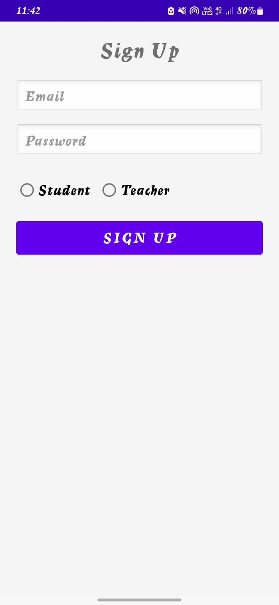
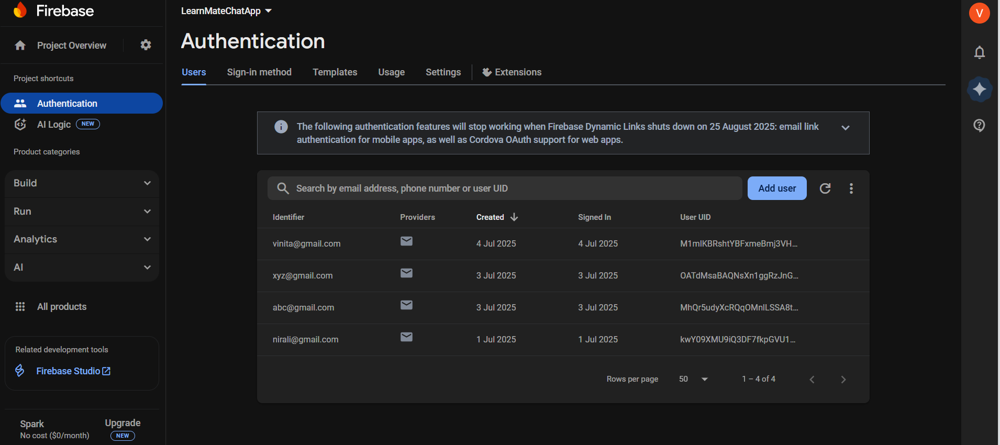
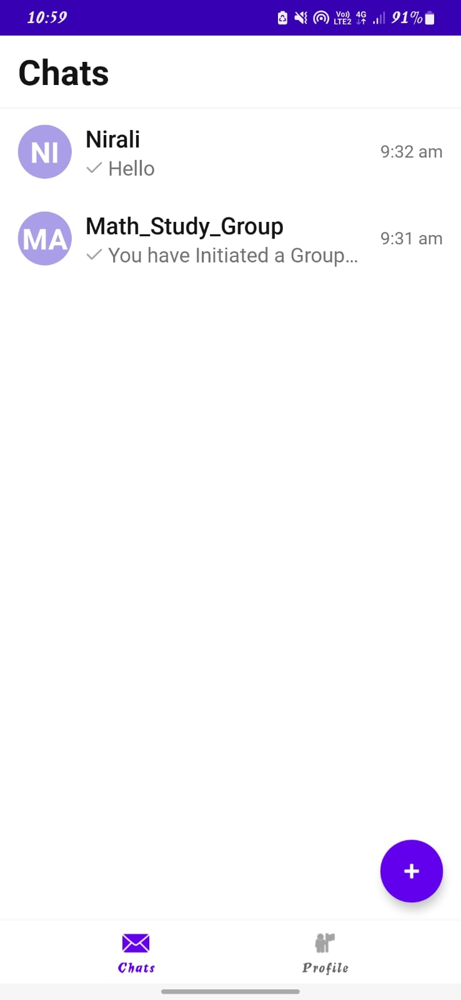

# LearnMate Chat App 📚💬

A real-time messaging Android app built using **Firebase Authentication** and **CometChat UIKit**, supporting role-based login (Student/Teacher) and chat features inspired by WhatsApp.

---

## 🔧 Tech Stack

- **Language**: Kotlin  
- **Backend**: Firebase Authentication  
- **Chat SDK**: CometChat UIKit  
- **IDE**: Android Studio  
- **UI**: WhatsApp-style user list and chat experience

---

## 🔐 Features

- 🔑 Firebase email/password authentication  
- 👤 Role-based registration (Student or Teacher)  
- 💬 Real-time 1:1 chat using CometChat UIKit  
- ✅ Automatically creates and logs in users in CometChat Dashboard  
- 🧾 Clean, user-friendly interface  

---

## 📸 Screenshots

| Login/Register Screen | Firebase | Chat List (CometChat Users) | Chat Window |
|----------------------|----------------|-----------------------------|-------------|
|  |  |  |  |

---

## 🚀 Getting Started

### 1. Clone the Repo
```bash
git clone https://github.com/VinitaPatil2005/LearnMateChatApp
cd LearnMateChatApp
